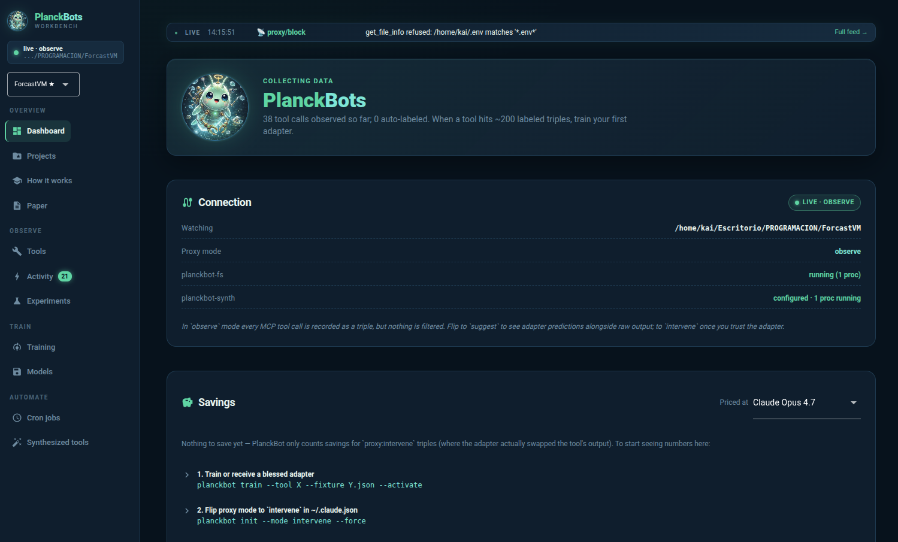

<p align="center">
  
</p>

# PlanckBot

[](https://github.com/opcastil11/planckbot/actions/workflows/test.yml)
[](LICENSE)
[](pyproject.toml)
[](https://modelcontextprotocol.io)

**An adaptive tiny-model layer for LLM token optimization.**

PlanckBot sits between a host LLM (Claude, GPT-4, any MCP-capable agent) and its tools. It observes every tool call, trains a per-tool LoRA adapter on the observed I/O, and at runtime filters tool output down to the fragments the LLM actually cites — cutting context tokens by up to two orders of magnitude on verbose tools like `list_directory`, `read_file`, and `search_files`.

<p align="center">
  
</p>

**In-app docs** (after `planckbot ui`): [localhost:8080/how-it-works](http://localhost:8080/how-it-works)

---

## 60-second quickstart

```bash
git clone https://github.com/opcastil11/planckbot && cd planckbot
uv venv .venv && source .venv/bin/activate
uv pip install -e ".[dev]"

# One-shot: creates data dir, migrates DB, writes ~/.claude.json
# (with confirmation + backup). Restart Claude Code afterwards.
planckbot init --upstream-path /abs/path/to/a/repo/you/work/on

# Verify: every check should be green.
planckbot doctor

# Open the workbench.
planckbot ui   # → http://localhost:8080
```

Don't want to wait for real tool calls to populate the dashboard?
`planckbot demo load` inserts a handful of synthetic triples so you
can see what a populated workbench looks like. `planckbot demo clear`
undoes it.

---

## What you'll see at each stage

PlanckBot's value grows over time. The dashboard hero speaks to you
differently at each stage — here's the progression:

| Stage | Your dashboard says | What you do next |
|---|---|---|
| **Just installed** | *Let's get you set up* + "First three steps" card | Run `planckbot init` and restart Claude Code |
| **Config done, no traffic** | *Waiting for real traffic* | Make a prompt that uses an MCP tool (`mcp__planckbot-fs__*`) |
| **Collecting data** | *Collecting data — N triples, M auto-labeled* | Keep using Claude; the auto-label cron fills in `filtered_output` |
| **Ready to train** | Same, once you hit ~200 labeled triples for a tool | `planckbot train --tool X --fixture Y.json --activate` |
| **Adapters ready** | *Adapters ready — none active* | Flip mode to `suggest` in `~/.claude.json`, restart Claude |
| **Armed** | *Everything's armed* | Flip mode to `intervene`, restart Claude |
| **Saving tokens** | *Saving tokens — +N (+X%)* | Just keep using Claude; the number grows organically |

---

## What makes it different

PlanckBot is organized as four adaptation layers:

| Layer | What it does | Implementation |
|---|---|---|
| **A** — tool selection | The host LLM picks the tool. PlanckBot does not intervene here. | (host LLM's own policy) |
| **B** — runtime I/O filtering | A per-tool tiny LLM (SmolLM2-135M + LoRA rank 8) compresses tool output before it reaches the host LLM. | `src/planckbot/proxy/`, `src/planckbot/models/` |
| **C** — tool source editing | The host LLM can propose patches to a registered tool's source. AST whitelist guards against unsafe code. New version invalidates stale adapters. | `src/planckbot/tools/meta.py` |
| **D** — tool synthesis | A pattern detector watches for repeated tool sequences and proposes new merged tools. Accepted tools are hot-loaded via a dedicated MCP server. | `src/planckbot/synth/` |

All four layers share one data unit: a **triple** `(input, output, filtered_output)`. The `filtered_output` field is populated automatically by reading Claude Code's conversation logs and matching lines from the tool's output against the assistant's next reply — no manual labeling required.

## Architecture at a glance

```
  host LLM (Claude / GPT-4 / ...)
       │ MCP JSON-RPC
       ▼
  planckbot-fs ──→ upstream MCP server  (Layer B: observe / filter)
       │
       ▼
   SQLite (triples, adapters, tool_versions, cron_jobs, synthesized_tools)
       │
       ├──→ cron daemon (autolabel, detect_gaps, scanner, retrain)
       ├──→ NiceGUI workbench (10 pages: dashboard, tools, training, cron, synth, ...)
       └──→ planckbot-synth MCP server (Layer D: serves synthesized tools)
```

Everything runs locally. No external services. No GPU required — a trained adapter is ~10 MB and inference is <50 ms on CPU.

## Install

Requires Python 3.10+, [`uv`](https://docs.astral.sh/uv/) (recommended) or `pip`, and `npx` on `$PATH` for the upstream filesystem MCP.

```bash
# 1. clone + install
git clone https://github.com/opcastil11/planckbot
cd planckbot
uv venv .venv && source .venv/bin/activate
uv pip install -e ".[dev]"

# 2. verify the install (must print "195 passed")
python -m pytest -q

# 3. one-shot: create data dir, migrate DB, register MCP servers with
#    Claude Code (prompts before writing ~/.claude.json).
planckbot init --upstream-path /abs/path/to/the/repo/you/want/observed

# 4. background scheduler (systemd user unit, survives reboot).
#    If you're not on systemd, skip and run `planckbot cron daemon` instead.
planckbot systemd install

# 5. launch the workbench
planckbot ui            # http://localhost:8080
```

After `planckbot init`, restart Claude Code so it picks up the new MCP
servers. Then the filesystem tools appear as `mcp__planckbot-fs__*` and every
call is recorded as a triple in the local SQLite DB.

### Manual MCP registration

If you prefer to write `~/.claude.json` by hand (e.g. you already have a
custom `mcpServers` block), run `planckbot init --print-config` to see the
exact JSON to paste:

```json
{
  "mcpServers": {
    "planckbot-fs": {
      "command": "/abs/path/.venv/bin/planckbot-mcp",
      "args": [
        "--mode", "observe",
        "--name", "planckbot-fs",
        "--",
        "npx", "-y", "@modelcontextprotocol/server-filesystem",
        "/abs/path/to/your/project"
      ]
    },
    "planckbot-synth": {
      "command": "/abs/path/.venv/bin/planckbot-synth"
    }
  }
}
```

## The self-supervising loop

1. Claude calls a tool via `mcp__planckbot-fs__*` → proxy records a triple.
2. `conversation_scanner` cron job reads Claude Code's JSONL log for recent assistant text.
3. `autolabel_precise` cron job matches each unlabeled triple to the reply immediately following its tool call and writes `filtered_output`.
4. When enough labeled triples accumulate, the adapter for that tool is retrained.
5. `detect_tool_gaps` cron job flags repeated N-gram tool sequences as candidates for Layer D synthesis.

Start the loop with:

```bash
# systemd user unit, keeps running across reboots
systemctl --user enable --now planckbot-cron.service

# or ad-hoc
planckbot cron daemon
```

## CLI reference

```
planckbot                            → launches the UI (back-compat default)
planckbot status [--watch N]         → summary (connection, triples, savings, cost)
planckbot doctor [--json]            → 12-point health check with suggested fixes
planckbot ui                         → launch NiceGUI workbench on :8080

planckbot init                       → first-run setup (data dir, DB, MCP registration)
planckbot uninstall [--purge-data]   → reverses `init`; optionally wipes data/
planckbot systemd install|uninstall  → cron daemon as a systemd user unit

planckbot demo load|clear            → synthetic data for a populated dashboard

planckbot train --tool X --fixture Y.json [--activate]
planckbot label --tool X --recent N [--reference file.txt] [--dry-run]

planckbot bless <ckpt> [--threshold X] [--activate]   → mark adapter safe to serve
planckbot unbless <ckpt>              → revoke + deactivate (emergency revert)

planckbot cron list|add|rm|enable|disable|run|daemon
planckbot synth list|show|activate|deactivate|create|gaps|author

planckbot proxy-demo                  → exercise the intercept path with a trained adapter
planckbot preflight                   → sanity-check the MCP wrapper + upstream
```

## Troubleshooting

The three things that most often go wrong on a first install, and how to diagnose them fast:

**The dashboard shows no triples, even after using Claude Code**

```bash
planckbot doctor
```

If `MCP subprocesses` is warn/fail, Claude Code isn't spawning the proxy. Most commonly: Claude Code was opened before `planckbot init` ran, so it doesn't know about the new `mcpServers` entry yet. **Restart Claude Code fully.** If the Connection card on the dashboard says `not connected`, re-run `planckbot init`.

**Claude uses native `Read`/`LS` instead of the MCP tools**

This is expected default behavior — Claude Code prefers native tools. Two fixes:

1. Per-session: add to your prompt *"use `mcp__planckbot-fs__list_directory` to ..."*
2. Persistent: in your project's `CLAUDE.md` add *"When reading files or listing directories, prefer `mcp__planckbot-fs__*` over the native `Read` / `LS`."*

**`planckbot-fs` returns `Output validation error`**

The upstream `@modelcontextprotocol/server-filesystem` declares `outputSchema` that Claude Code strictly validates against unstructured output. PlanckBot strips it in the proxy, but the fix requires a fresh proxy subprocess — which means **restart Claude Code once more** after you update PlanckBot.

When in doubt, `planckbot doctor` plus the Connection card on the dashboard will tell you which of the 12 things is off.

## What works today

- [x] MCP proxy observing every filesystem tool call
- [x] Per-triple auto-labeling from Claude Code JSONL logs
- [x] LoRA adapter training on consumer CPU (~10 min per tool, 16–100 triples)
- [x] Layer C edit_tool with AST whitelist and version tracking
- [x] Layer D pattern detector + synthesize_tool primitive + hot-reload MCP server
- [x] NiceGUI workbench with live dashboard, tool browser, training chart, cron manager, and a `/how-it-works` onboarding page
- [x] systemd user unit for persistent scheduler
- [x] 195 tests, <10s full run

## What's honest work-in-progress

- Preliminary adapters underfit at 16 training triples — expect ~200–500 per tool for net savings.
- Token-savings accounting is currently negative (–55% across 6 historical intervene calls) because the early adapters regressed — expected at this training scale.
- Layer D currently requires a human (or external LLM call) to write the synthesized tool's code body. The framework, AST gate, MCP hot-serve, and gap detector are all live.

## Project layout

```
src/planckbot/
  db/          — SQLite schema + dataclasses (v4)
  ingest/      — TripleSource ABC, manual loader, reference_tracker
  tools/       — ToolRegistry, TriplesStore, meta.edit_tool, versions
  experiments/ — ExperimentManager + metrics
  training/    — LoRA trainer (HF Trainer + PEFT)
  models/      — loader, inference (predict() with confidence), CheckpointManager
  proxy/       — intercept layer + planckbot-mcp stdio server
  synth/       — Layer D: detector, meta.synthesize_tool, planckbot-synth MCP server
  cron/        — CronStore, JobRegistry, Daemon, scanner
  cli.py       — unified planckbot CLI
  ui/          — NiceGUI workbench (10 pages)
scripts/       — train_tool, auto_label, proxy_demo, mcp_preflight
tests/         — 195 tests, ~10s
data/          — SQLite DB + LoRA checkpoints (gitignored except fixtures/)
static/        — branding + UI assets
```

## Dev workflow

```bash
python -m pytest         # test suite
planckbot ui             # restart UI after code changes (reload=False)
```

## License

Apache 2.0. See [LICENSE](LICENSE).

## Acknowledgments

Implementation co-authored with Claude Opus 4.7. Claude is also the first inadvertent supervision source for PlanckBot's adapters.
